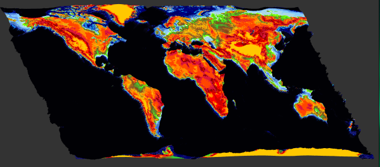
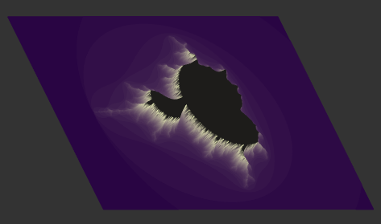
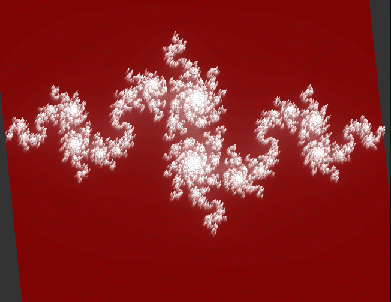
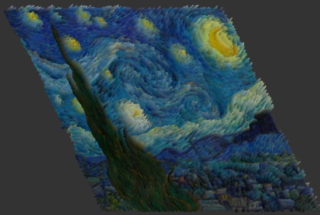

# LineEngine

LineEngine is a lightweight C++/OpenGL application that renders 3D line maps from `.lge` files.
It uses SDL2 for windowing/input, GLEW for OpenGL extensions, and glm for math.

**Screenshots**

World example:


Fractal example:


Julia set example:


Van Gogh portrait example:


## Features

- Lightweight OpenGL line renderer for `.lge` map files.
- Isometric and top views with configurable rotations and scaling.
- Keyboard + mouse controls for interactive exploration.
- Ships with a large set of `test_maps` for quick demonstrations.

## Requirements

- C++17 compiler (g++, clang++)
- CMake 3.15+
- SDL2 development headers
- GLEW development headers
- glm development headers
- OpenGL development libraries

On Debian/Ubuntu you can install the common dependencies with:

```bash
sudo apt update
sudo apt install build-essential cmake libsdl2-dev libglew-dev libglm-dev libgl1-mesa-dev
```

## Build

From the project root:

```bash
mkdir -p build
cd build
cmake ..
cmake --build . -- -j$(nproc)
```

The built binary will be at `build/bin/LineEngine`. CMake copies the `Shaders/` and `test_maps/` folders into the build output directory automatically.

## Run

Example:

```bash
./build/bin/LineEngine test_maps/basictest.lge
```

The program expects exactly one argument: the path to a `.lge` file.

## Controls

- Escape: Quit
- `I`: Reset to isometric view
- `T`: Reset to top (orthographic) view
- Arrow keys or `W`/`A`/`S`/`D`: Pan the view
- `X`/`Y`/`Z` (isometric only): Rotate +5° on respective axis
- `J`/`K`/`L` (isometric only): Rotate -5° on respective axis
- `+`/`=` and `-`: Zoom in/out
- Mouse wheel: Zoom in/out
- Left mouse button + drag: Pan (click & drag)

## Example maps

See the bundled maps in [test_maps](test_maps/) for many examples including world maps, fractals and artistic inputs.

## Shaders

Shaders are located in `Shaders/` and are automatically copied into the build directory by CMake. You can edit them and rebuild to change rendering appearance.

## Contributing

Contributions and bug reports are welcome. Open an issue or submit a pull request with a focused change.

## License

This project does not include a license file. If you want this repository to be explicitly open-source, add a `LICENSE` file describing the terms.
